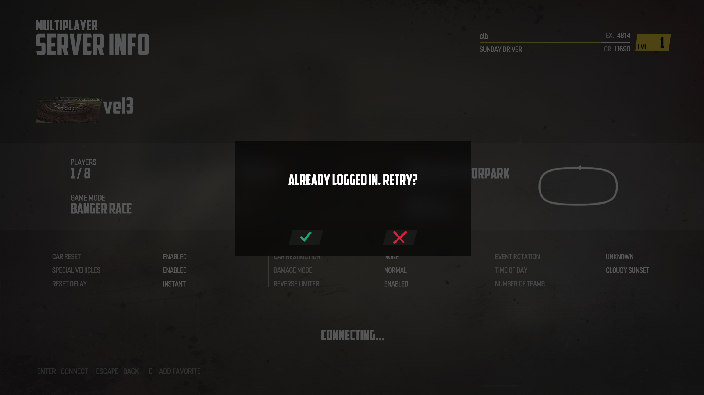
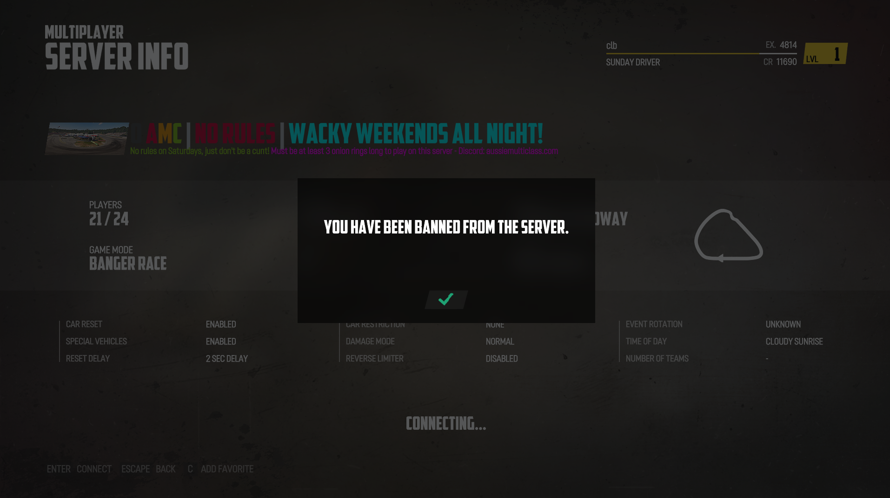

GOG Wreckfest LAN fix launcher
==============================

This launcher fixes up GOG's botched LAN support for Wreckfest.

Due to a programming/packaging error from GOG's behalf, if multiple people who bought Wreckfest from GOG try to join the same LAN game server, they will get an error "Already Logged In. Retry?"

This is due to GOG assigning the same hardcoded/dummy player ID `99642141755572224` to all users who play Wreckfest from GOG, when not using GOG Galaxy installer.

To fix this problem and to enable LAN play, this patch randomizes the player ID for each player. It also allows players to enter a custom player name, rather than the game doxxing their Windows PC user name to the public game server.

It is based on DLLs from https://gitlab.com/Mr_Goldberg/goldberg_emulator/-/jobs/4247811310/artifacts/download
See https://gitlab.com/Mr_Goldberg/goldberg_emulator/blob/master/README.md for more information.

The LAN player profile is set up to have 100 million credits and XP to allow unlocking all cars
and upgrades for casual LAN play.

Installation Instructions
-------------------------

1. Install Wreckfest from GOG.
2. Download [Wreckfest_GOG_offline_lan_mode_patch.zip](https://github.com/juj/Wreckfest_GOG_offline_lan_mode_patch/raw/main/zip/Wreckfest_GOG_offline_lan_mode_patch.zip) and unzip it to the root directory where Wreckfest was installed, e.g. `C:\GOG Games\Wreckfest\`.
3. Launch the game from `wreckfest_lan_launcher.bat` in the Wreckfest directory.

If you are having connection troubles, make sure to enable the Windows firewall pop-up in the background.

What this patch does not fix
----------------------------

While this patch is active, it does not allow one to host or join internet multiplayer servers. Gameplay is restricted to LAN only while the patch is active. The launcher bat script provides an easy way to switch between playing with the patch enabled or disabled.

However, the same programming/packaging bug still remains with online play: if you try to join a multiplayer game on an internet server, you may get the error "Already Logged In. Retry?" or an error

if the hardcoded/dummy player ID `99642141755572224` happens to have been banned from that server. That is, even if you might never have played on a particular server, the GOG player ID may have already been banned there. This patch does not have the ability to fix this multiplayer problem, but GOG should fix it themselves.

If you are a Wreckfest game server host, you can alleviate the problem a little bit by verifying that the player ID `99642141755572224` is not banned. There may be hundreds of different players unknowingly playing with that player ID.

Limitations
-----------

It seems that while the patch is active, the game server still needs to authenticate with Wreckfest online DRM (even though GOG states that they would sell DRM free games, sigh..). So this means that the game server does need to have an online internet connection. However, the game clients that join in the game do not need internet connectivity, and all gameplay traffic should flow strictly through LAN.
